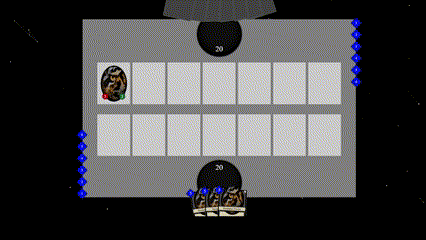

# Creations Haven Prototype

A frontend prototype/proof of concept for a card game built using **React**, **Redux**, and **Gatsby**. This project showcases a interactive card game interface, leveraging state management and fast, optimized static site generation.



## Features

- **React**: Component-based UI for modular and reusable game elements.
- **Redux**: State management for tracking match progress and actions.
- **Gatsby**: Fast static site generation.

## Getting Started

### Prerequisites

Ensure you have the following installed on your machine:

- [Node.js](https://nodejs.org/) (v14 or later)
- [npm](https://www.npmjs.com/) or [Yarn](https://yarnpkg.com/)

### Installation

1. **Clone the repository:**

   ```bash
   git clone https://github.com/brcards/CreationsHaven.git
   ```

2. **Install dependencies:**

   ```bash
   npm install
   ```
   
3. **Run the development server:**

   ```bash
   gatsby develop
   ```

4. **Open the game in your browser:**

   Navigate to `http://localhost:8000`

## Project Structure

```
card-game-prototype/
├── scripts/
│   ├── CreateModule/       # Creates a ui module from templates
├── resource/               # project resources
├── src/
│   ├── common/             # Common code that doesn't belong to a module
│   ├── eninge/             # Game Engine specific code
│   ├── images/             # Game images
│   ├── modules/            # Reusable UI components (cards, buttons, etc.)
│   ├── pages/              # Site pages
│   ├── rootReducer.js      # Game images
│   └── store.js            # Store for the redux application
├── static/                 # Static assets (images, icons, etc.)
├── gatsby-config.js        # Gatsby configuration file
└── package.json            # Project metadata and scripts
```

## Available Scripts

- `gatsby develop` : Starts the development server.
- `npm run create-module [module name]` : Creates a new module from templates in modules directory

This project is licensed under the [MIT License](LICENSE).
